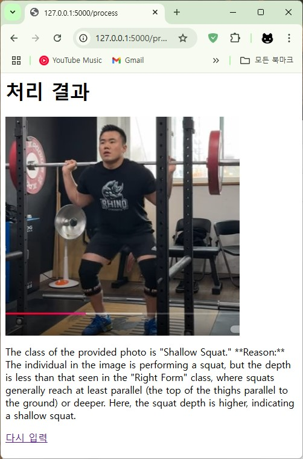
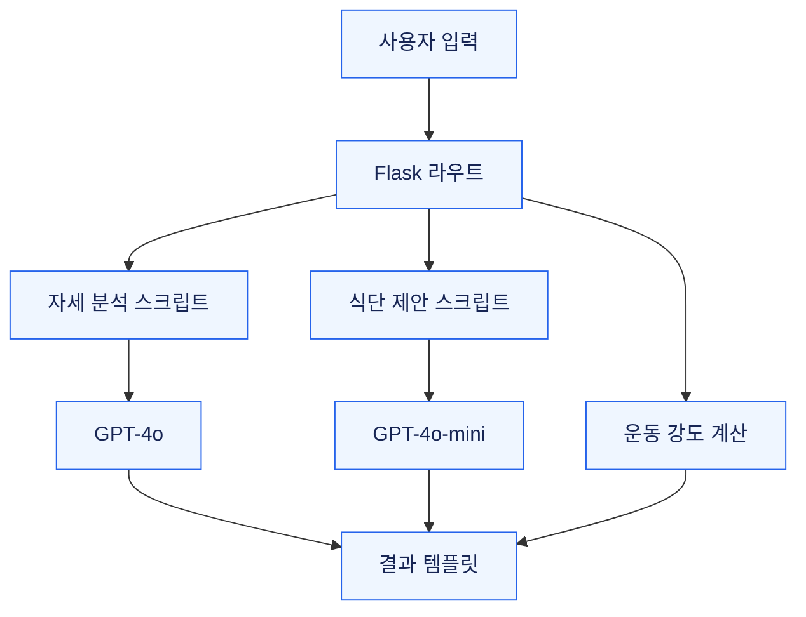

# AI Trainer

**운동 사진의 URL을 입력받아 자세 분석 결과와 운동·식단 가이드를 제공하는 Flask 서비스**


**개인 개발** · 조동휘: 서비스 설계·구현 · 연구 자료의 저자 정보는 하단에 표기

[서비스 화면](#서비스-화면) · [구현 구조](#구현-구조) · [모델 비교](#모델-비교와-연구-기록) · [실행 방법](docs/SETUP.md)

## 프로젝트 개요

운동 초보자가 자신의 스쿼트 자세를 이해할 수 있도록 이미지와 예시 데이터를 외부 AI API에 전달하고 결과를 웹 화면으로 보여줍니다. 자세 분석, 입력값 기반 운동 강도 계산, 보유 식재료를 활용한 식단 제안을 각각의 기능으로 제공합니다.

| 기능 | 입력 | 처리 |
| :--- | :--- | :--- |
| 자세 분석 | 접근 가능한 운동 이미지 URL | GPT-4o에 예시 이미지와 함께 전달하여 자세 분류·설명 생성 |
| 운동 강도 | 성별·체중·키·골격근량 | 서버의 계산 규칙으로 수준과 스쿼트 중량 제안 |
| 식단 제안 | 골격근량·보유 식재료 | GPT-4o-mini에 전달하여 식단 응답 생성 |

## 서비스 화면

<a href="Result_img/Servic_Img/결과화면.jpg"></a>

*개발 당시 자세 분석 결과 화면입니다. 원본 이미지를 열어 응답 내용을 확인할 수 있습니다.*

## 구현 구조



### 01. 웹 입력부터 AI 응답까지 연결

Flask는 폼 값을 받아 별도 Python 스크립트를 실행하고, 표준 출력으로 받은 결과를 템플릿에 전달합니다. 자세 분석의 입력은 **파일 업로드가 아닌 이미지 URL**입니다.

[Flask 라우트](AiTrainer_flaskServer/app.py) · [자세 분석](AiTrainer_flaskServer/ask2GTP_posture.py) · [식단 제안](AiTrainer_flaskServer/ask2GTP_diet.py)

### 02. 예시 이미지로 판단 기준 제공

자세 분석 요청에 클래스별 5장, 총 20장의 예시 이미지를 포함합니다. 모델의 가중치를 다시 학습시키는 방식이 아니라, 요청 문맥에 예시를 제공하는 **Few-shot prompting**입니다.

| 분류 | 의미 |
| :--- | :--- |
| Shallow Squat | 가동 범위 부족 |
| Knee Valgus | 무릎이 안쪽으로 모이는 자세 |
| Wrong Spinal Alignment | 척추 정렬 문제 |
| Right Form | 올바른 자세 |

### 03. 연구 코드와 서비스 코드 구분

`models_code`에는 모델과 프롬프트 조건을 비교한 실험 코드가 있습니다. `AiTrainer_flaskServer`는 사용자의 입력을 받아 결과를 보여주는 서비스입니다. MediaPipe와 GPT 결과를 실시간으로 합치는 앙상블 서비스로 구현된 것은 아닙니다.

## 모델 비교와 연구 기록

아래 수치는 **기존 README에 기록된 연구 보고값**입니다. 이번 문서 정리에서 모델 호출을 다시 실행하거나 집계값을 재산출하지 않았습니다.

| 모델 | Precision | Recall | F1 | Accuracy |
| :--- | ---: | ---: | ---: | ---: |
| MediaPipe Pose | 0.862 | 0.825 | 0.829 | 0.812 |
| Plain ChatGPT | 0.740 | 0.525 | 0.450 | 0.525 |
| **Improved ChatGPT** | **0.962** | **0.925** | **0.929** | **0.912** |

기존 표 기준 정확도 차이는 **81.2% → 91.2%, +10.0%p**입니다. 이 결과를 모든 운동·사용자·촬영 조건으로 일반화하지 않습니다.

- 저장소의 데이터: 클래스별 예시 5장, 평가 이미지 10장
- 평가 스크립트: 클래스별 10장을 한 요청에 전달하는 구조
- 최종 표의 반복 실행 횟수·평균 방식은 별도 확인이 필요합니다.

[평가 스크립트](models_code/Trained_ChatGPT_API/5_Improved_ChatGPT.py) · [평가 원본 파일](Model_evaluation_result.xlsx) · [결과 이미지](Result_img/Output_results_for_each_model)

## 실행과 검증

[설치·실행 안내](docs/SETUP.md)에서 가상환경, API 키, 서버 실행, 입력 형식을 확인할 수 있습니다. [검증 기록](docs/VALIDATION.md)은 로컬 화면 확인과 실제 AI 호출 검증을 구분합니다.

## 현재 한계와 다음 개선

- 외부 API 응답을 기다리는 동기 처리입니다. 타임아웃과 실패 시 사용자 안내를 보강할 필요가 있습니다.
- 이미지 URL 검증, 입력 검증, 결과 구조화를 개선할 예정입니다.
- 호출마다 예시 이미지가 포함되므로 지연 시간과 호출 비용 측정이 필요합니다.
- 운동·식단 응답은 연구용 가이드이며 개인의 신체 상태에 대한 검증된 진단을 의미하지 않습니다.

## 연구 자료

**Kyung Hee University, School of Computing**<br>
연구 자료 저자: 조동휘(DongHwee Cho), 성무진(Mujeen Sung)

[연구 보고서](AI%20Trainer%20for%20Fitness%20Beginner_조동휘.pdf) · [발표 자료](AI%20Trainer%20for%20Fitness%20Beginner_조동휘.pptx)

<details>
<summary>프로젝트 구조</summary>

```text
AiTrainer_flaskServer/  웹 라우트, AI 호출 스크립트, 템플릿
models_code/           MediaPipe 및 GPT 비교 실험
squat_img/             예시·평가 이미지
Result_img/            실험 결과와 개발 당시 화면
```

</details>
