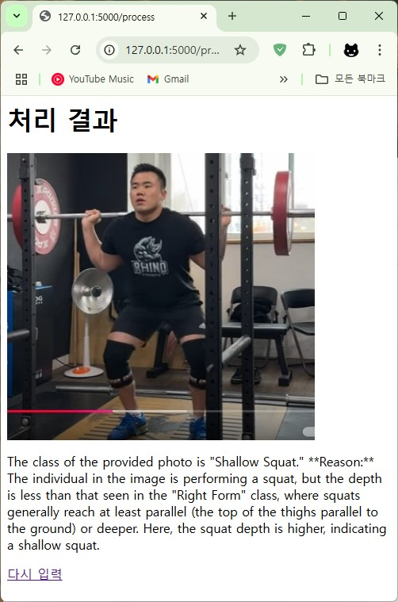
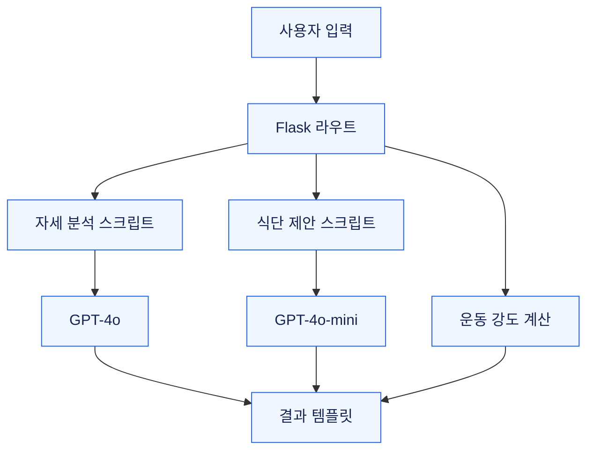

# AI Trainer

**운동 사진의 URL을 입력받아 자세 분석 결과와 운동·식단 가이드를 제공하는 Flask 서비스**


**개인 개발** · 조동휘: 서비스 설계·구현 · 연구 자료의 저자 정보는 하단에 표기

[서비스 화면](#서비스-화면) · [구현 구조](#구현-구조) · [모델 비교](#모델-비교와-연구-기록) · [실행 방법](docs/SETUP.md)

## 서비스 화면

<a href="Result_img/Servic_Img/결과화면.jpg"></a>

*개발 당시 자세 분석 결과 화면입니다. 원본 이미지를 열어 응답 내용을 확인할 수 있습니다.*

## 프로젝트 개요

운동 초보자가 자신의 스쿼트 자세를 이해할 수 있도록 이미지와 예시 데이터를 외부 AI API에 전달하고 결과를 웹 화면으로 보여줍니다.

- **자세 분석**: 접근 가능한 운동 이미지 URL과 예시 이미지를 GPT-4o에 전달하여 자세 분류·설명을 생성합니다.
- **운동 강도**: 성별·체중·키·골격근량을 서버의 계산 규칙에 적용하여 수준과 스쿼트 중량을 제안합니다.
- **식단 제안**: 골격근량·보유 식재료를 GPT-4o-mini에 전달하여 식단 응답을 생성합니다.

## 구현 구조


```mermaid
flowchart TD
    U[사용자 입력] --> F[Flask 라우트]
    F --> P[자세 분석 스크립트]
    F --> I[운동 강도 계산]
    F --> D[식단 제안 스크립트]
    P --> G[GPT-4o]
    D --> M[GPT-4o-mini]
    G --> R[결과 템플릿]
    M --> R
    I --> R
    classDef default fill:#eff6ff,stroke:#2563eb,color:#172554
```

### 01. 웹 입력부터 AI 응답까지 연결

Flask는 폼 값을 받아 별도 Python 스크립트를 실행하고, 표준 출력으로 받은 결과를 템플릿에 전달합니다. 자세 분석의 입력은 **파일 업로드가 아닌 이미지 URL**입니다.

[Flask 라우트](AiTrainer_flaskServer/app.py) · [자세 분석](AiTrainer_flaskServer/ask2GTP_posture.py) · [식단 제안](AiTrainer_flaskServer/ask2GTP_diet.py)

### 02. 예시 이미지로 판단 기준 제공

자세 분석 요청에 클래스별 5장, 총 20장의 예시 이미지를 포함합니다. 모델의 가중치를 다시 학습시키는 방식이 아니라, 요청 문맥에 예시를 제공하는 **Few-shot prompting**입니다.

| 분류 | 의미 |
| :--- | :--- |
| Shallow Squat | 가동 범위 부족 |
| Knee Valgus | 무릎이 안쪽으로 모이는 자세 |
| Wrong Spinal Alignment | 척추 정렬 문제 |
| Right Form | 올바른 자세 |

### 03. 연구 코드와 서비스 코드 구분

`models_code`에는 모델과 프롬프트 조건을 비교한 실험 코드가 있습니다. `AiTrainer_flaskServer`는 사용자의 입력을 받아 결과를 보여주는 서비스입니다. MediaPipe와 GPT 결과를 실시간으로 합치는 앙상블 서비스로 구현된 것은 아닙니다.

## 모델 비교와 연구 기록

아래 수치는 [연구 보고서](AI%20Trainer%20for%20Fitness%20Beginner_조동휘.pdf)의 **4~6쪽 표에 기록된 보고값**입니다. 4개 자세 유형에 대해 클래스별 10장, 총 40장의 평가 이미지를 사용했습니다. 이번 문서 수정에서는 실험을 다시 실행하거나 원시 결과를 재집계하지 않았습니다.

### 모델별 비교

다음 표는 논문 그림 14·16·19·22의 클래스별 평균을 소수 둘째 자리 표기 그대로 옮긴 것입니다.

| 모델 | Precision | Recall | 평균 F1 | Accuracy (클래스별 평균) |
| :--- | ---: | ---: | ---: | ---: |
| MediaPipe Pose | 0.75 | 0.75 | 0.73 | 0.88 |
| Plain ChatGPT | 0.63 | 0.53 | 0.50 | 0.76 |
| Trained ChatGPT (예시 이미지 제공) | 0.71 | 0.70 | 0.69 | 0.85 |
| **Improved ChatGPT** | **0.86** | **0.83** | **0.83** | **0.91** |

- 초기 비교에서는 MediaPipe가 Plain ChatGPT보다 높은 평균 F1을 기록했습니다.
- 예시 이미지, 프롬프트 언어, 시스템 지시를 개선한 뒤 Improved ChatGPT의 평균 F1은 약 **0.83**으로 MediaPipe의 약 **0.73**보다 높았습니다.
- 척추 정렬 문제의 F1은 MediaPipe **0.60**, Improved ChatGPT **0.82**였습니다. 다만 가동 범위 부족에서는 MediaPipe **1.00**, Improved ChatGPT **0.70**으로, 모든 클래스에서 우세한 결과는 아닙니다.
- Accuracy는 논문에 제시된 클래스별 이진 분류 정확도의 평균입니다. 40장 중 올바르게 분류한 이미지의 비율인 전체 다중 클래스 정확도와 구분합니다.

### Ablation study

논문 그림 24의 수치를 그대로 옮겼습니다. 최종 설정에서 프롬프트 언어, 시스템 지시, 예시 데이터 조건을 각각 바꾸어 비교했습니다.

| 조건 | Precision | Recall | 평균 F1 | Accuracy (클래스별 평균) |
| :--- | ---: | ---: | ---: | ---: |
| 최종 설정 (Improved ChatGPT) | 0.8621 | 0.825 | 0.8292 | 0.9125 |
| 영어 → 한국어 (Translation) | 0.7996 | 0.775 | 0.7749 | 0.8875 |
| 역할 지시 제거 (Role Omission) | 0.815 | 0.775 | 0.783 | 0.8875 |
| 이전 예시 데이터 (Old Training Data) | 0.7439 | 0.7 | 0.6964 | 0.85 |

이 비교에서는 이전 예시 데이터를 사용한 조건에서 평균 F1의 감소 폭이 가장 컸습니다. 논문의 "Trained"와 "Training Data"는 코드상 요청에 예시 이미지를 포함하는 few-shot prompting을 가리킵니다.

현재 공개된 개선 모델 평가 코드의 시스템 지시는 `make sure to provide the answer the user wants.`입니다. 특정 의료 전문가 페르소나를 지정한 문구는 아닙니다.

### 평가 범위

- 저장소의 예시 이미지: 클래스별 5장, 총 20장
- 평가 이미지: 별도 경로에 클래스별 10장, 총 40장
- 평가 스크립트: 클래스별 평가 이미지 10장을 한 요청에 전달
- 반복 실행 횟수와 실행 간 변동성은 논문에서 확인되지 않습니다.
- 이 결과는 해당 이미지 평가셋에서의 보고값이며, 모든 운동·사용자·촬영 조건의 성능으로 일반화하지 않습니다.

[평가 스크립트](models_code/Trained_ChatGPT_API/5_Improved_ChatGPT.py) · [평가 원본 파일](Model_evaluation_result.xlsx) · [결과 이미지](Result_img/Output_results_for_each_model)

## 실행과 검증

[설치·실행 안내](docs/SETUP.md)에서 가상환경, API 키, 서버 실행, 입력 형식을 확인할 수 있습니다. [검증 기록](docs/VALIDATION.md)은 로컬 화면 확인과 실제 AI 호출 검증을 구분합니다.

## 현재 한계와 다음 개선

- 외부 API 응답을 기다리는 동기 처리입니다. 타임아웃과 실패 시 사용자 안내를 보강할 필요가 있습니다.
- 이미지 URL 검증, 입력 검증, 결과 구조화를 개선할 예정입니다.
- 호출마다 예시 이미지가 포함되므로 지연 시간과 호출 비용 측정이 필요합니다.
- 운동·식단 응답은 연구용 가이드이며 개인의 신체 상태에 대한 검증된 진단을 의미하지 않습니다.

## 연구 자료

**Kyung Hee University, School of Computing**<br>
연구 자료 저자: 조동휘(DongHwee Cho), 성무진(Mujeen Sung)

[연구 보고서](AI%20Trainer%20for%20Fitness%20Beginner_조동휘.pdf) · [발표 자료](AI%20Trainer%20for%20Fitness%20Beginner_조동휘.pptx)

<details>
<summary>프로젝트 구조</summary>

```text
AiTrainer_flaskServer/  웹 라우트, AI 호출 스크립트, 템플릿
models_code/           MediaPipe 및 GPT 비교 실험
squat_img/             예시·평가 이미지
Result_img/            실험 결과와 개발 당시 화면
```

</details>
